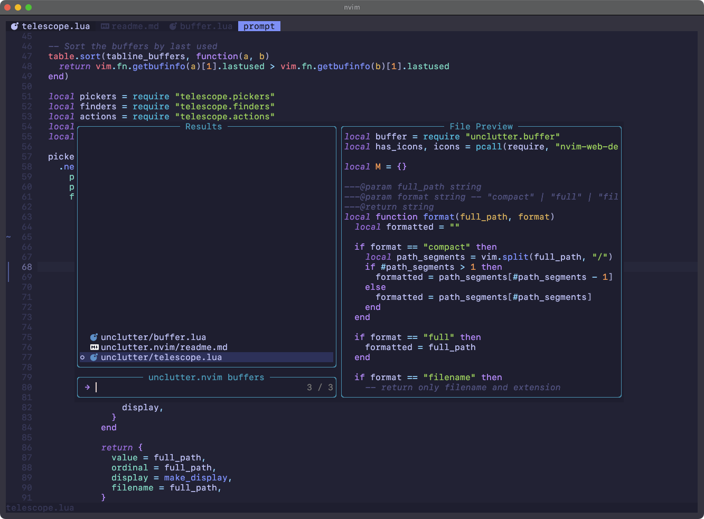

# unclutter.nvim

> Focus on what matters

*unclutter.nvim* is a **tabline that removes the clutter** to help you focus on the files that matter to **you**.


- [Installation](#installation)
  - [Lazy.nvim](#lazynvim)
  - [Packer.nvim](#packernvim)
- [Features](#features)
  - [Only show the buffers you need](#only-show-the-buffers-you-need)
  - [🔭 Telescope integration]()
- [Customization](#customization)
  - [Utils](#utils)
- [Inspiration](#inspiration)


## Installation

Use your favorite package manager. Calling the `setup()` function is optional.

### Lazy.nvim

```lua
{
  "pablopunk/unclutter.nvim",
  dependencies = { "nvim-tree/nvim-web-devicons" }, -- optional, to show icons on tabs
}
```

### Packer.nvim

```lua
use {
  "pablopunk/unclutter.nvim",
  requires = { "nvim-tree/nvim-web-devicons" }, -- optional, to show icons on tabs
}
```

## Features

You're working on a large project and you're jumping through function definitions and index files that endup cluttering your tabline. *Unclutter.nvim* will:

### Only show the buffers you need

A minimal tabline with icons will show:

- Buffers you made changes to.
- Buffers visible in any split.
- Buffers that were open on startup (neovim arguments, restored sessions...).
- Buffers that are not files (file tree, quickfix, help, terminal...).
- Buffers that are marked manually (read below).

Every other buffer will be closed at the time you leave it (`BufLeave`).

### 🔭 `telescope.nvim` integration

If you use [telescope.nvim](https://github.com/nvim-telescope/telescope.nvim), you can use it to list all your `unclutter.nvim` in a floating window:

```lua
require('unclutter').telescope()
```

Of course, you can map it to whatever you want:

```lua
vim.keymap.set("n", "<leader>b", require("unclutter").telescope, { noremap = true })
```



You can customize the format of the telescope results:

```lua
unclutter.telescope { format = "compact" } -- DEFAULT: folder/file.js
unclutter.telescope { format = "cwd" } -- path/folder/file.js
unclutter.telescope { format = "filename" } -- file.js
```

If you want to use the telescope integration without the tabline, you can disable it:

```lua
require('unclutter').setup {
  tabline = false,
}
```

## Customization

Here's the default configuration:

```lua
require('unclutter').setup {
  clean_after = 3, -- number of tabs to start uncluttering. i.e don't hide until 4 tabs are open
  tabline = true, -- show tabline. You can set it to false and only use the [telescope integration](#telescopenvim-integration)
}
```

### Utils

If you want to hack it or create your own mappings, you can use the following functions:

```lua
local unclutter = require("unclutter")

-- handle tabline buffers
unclutter.keep(bufnr)        -- Show buffer in tabline
unclutter.remove(bufnr)      -- Hide buffer from tabline
unclutter.toggle(bufnr)      -- Toggle buffer in tabline
unclutter.keep_current()     -- Show current buffer in tabline
unclutter.hide_current()     -- Hide current buffer from tabline
unclutter.toggle_current()   -- Toggle current buffer in tabline
unclutter.list()             -- List tabline buffers

-- navigate tabline buffers (like :bnext and :bprev)
unclutter.next()             -- Go to next buffer
unclutter.prev()             -- Go to previous buffer

-- handle plugin (on/off)
unclutter.enable()           -- Enable unclutter
unclutter.disable()          -- Disable unclutter
```

Example mappings:

```lua
vim.keymap.set("n", "gn", unclutter.next, { noremap = true })
vim.keymap.set("n", "gp", unclutter.prev, { noremap = true })
```

I personally have a map to save a file to disk (`<c-s>` will `:w`) so the buffer will be kept in the tabline whenever I do `<c-s>`.


## Inspiration

This behavior was inspired by vscode (sorry), that won't keep your tabs open until you hit save (or double-click the tab).

To create the tabline I used [*mini.tabline*](https://github.com/echasnovski/mini.tabline/) as a starting point. It's a great plugin and the one I was using before. The label/tabs implementation on [`tabline.lua`](./lua/unclutter/tabline.lua) is an adaptation of *mini.tabline*'s code.

Also this plugin was not only inspired by [harpoon](https://github.com/ThePrimeagen/harpoon) too, it's the main reason behind it. I was trying to hack harpoon to get this behavior, but didn't like the outcome. The plugin is great but I don't like their tabs implementation and other small stuff. It was there when I realized I could just code my own.

Other plugins I've used to unclutter in the past:

* [nvim-early-retirement](https://github.com/chrisgrieser/nvim-early-retirement)
* [hbac.nvim](https://github.com/axkirillov/hbac.nvim)


