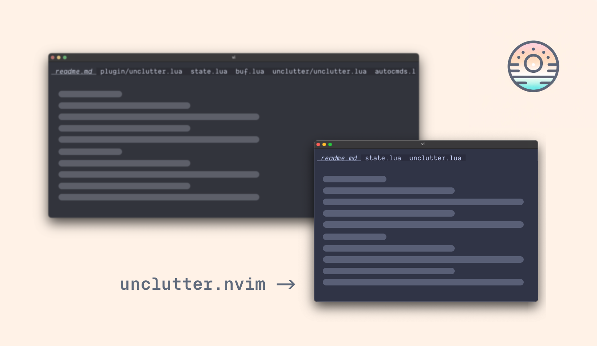
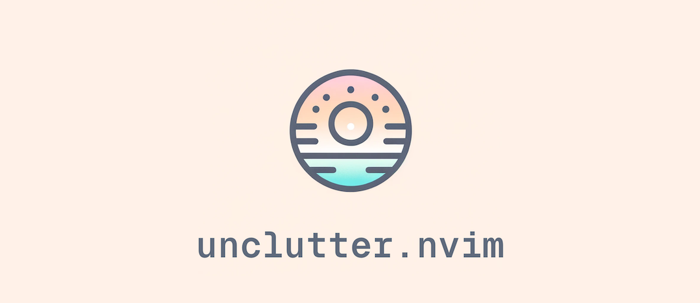

# unclutter.nvim (alpha)

> Focus on what matters

> [!NOTE]
> This plugin hasn't been tested in the wild yet. I'm using it myself and it works great, but I'm not sure if it's ready for everyone. I'm open to feedback and contributions.

*unclutter.nvim* removes the clutter from your buffer list to help you focus on the files that matter to you.



## Features

You're working on a large project and you're jumping through function definitions and index files that endup cluttering your buffer list.

If you use a plugin to show your buffers as tabs, or you list your buffers regularly, you know the pain. *unclutter.nvim* will:

### Keep only the buffers you need

- Buffers you made changes to.
- Buffers visible in any window.
- Buffers that were open on startup (neovim arguments, restored sessions...).
- Buffers that are not files (file tree, quickfix, help, terminal...).

Every other buffer will be closed.

## Installation

Use your favorite package manager.

### Lazy.nvim

```lua
{ "pablopunk/unclutter.nvim" }
```

### Packer.nvim

```lua
use { "pablopunk/unclutter.nvim" }
```

## Customization

There's nothing to configure, it just works. If you want to hack it, I've exposed a few utils to handle the buffers:

```lua
local unclutter = require("unclutter")

unclutter.add_buffer(bufnr)       -- add buffer to "wanted"
unclutter.add_current_buffer()    -- add current buffer to "wanted"
unclutter.toggle_buffer(bufnr)    -- toggle buffer in "wanted"
unclutter.toggle_current_buffer() -- toggle current buffer in "wanted"
unclutter.remove_buffer(bufnr)    -- remove buffer from "wanted"
unclutter.list_buffers()          -- list all wanted buffers [{ name, bufnr },...]

unclutter.disable()               -- disable the plugin
unclutter.enable()                -- enable the plugin
```

This is useful if you want to map a key to any of those:

```lua
vim.keymap.set("n", "<leader>m", unclutter.toggle_current_buffer, { noremap = true })
```

I personally have a map to save a file to disk (`<c-s>` will `:w`) so the buffer will be kept in the list whenever I do `<c-s>`.

## Inspiration

This behavior was inspired by vscode (sorry), that won't keep your tabs open until you hit save (or double-click the tab).

Also this plugin was not only inspired by [harpoon](https://github.com/ThePrimeagen/harpoon) too, it's the main reason behind it. I was trying to hack harpoon to get this behavior, but didn't like the outcome. The plugin is great but I don't like their tabs implementation and other small stuff. It was there when I realized I could just quickly code my own.

Other plugins I've used to unclutter in the past:

* [nvim-early-retirement](https://github.com/chrisgrieser/nvim-early-retirement)
* [hbac.nvim](https://github.com/axkirillov/hbac.nvim)


